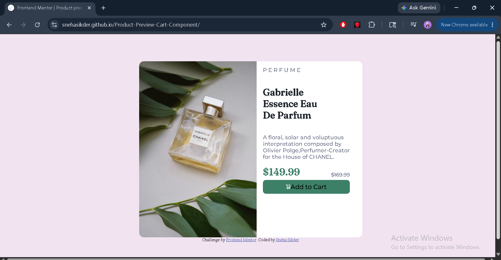

# Product-Preview-Cart-Component

This is a solution to the [Product Preview Cart Component on Frontend Mentor](https://www.frontendmentor.io/challenges/product-preview-card-component-GO7UmttRfa). Frontend Mentor challenges help you improve your coding skills by building realistic projects. 

### The challenge

Users should be able to:

- See hover and focus states for all interactive elements on the page

### Screenshot

### Links

- Solution URL: [Solution](https://github.com/Snehasikder/Product-Preview-Cart-Component)
- Live Site URL: [Live Site](https://snehasikder.github.io/Product-Preview-Cart-Component/)

### Built with

- Semantic HTML5 markup
- CSS custom properties
- Flexbox

### What I learned
I learnt patience and motivation.

## Author
- Website - [Snehasikder](https://github.com/Snehasikder)
- Frontend Mentor - [@Snehasikder](https://www.frontendmentor.io/profile/Snehasikder)

## Acknowledgments
I would acknowledge frontend mentor for its challenge.

